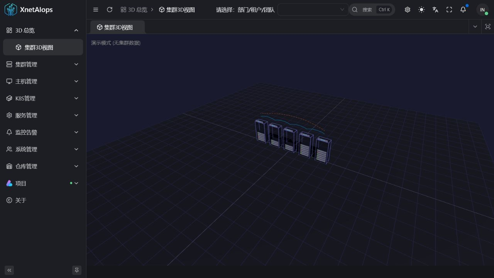
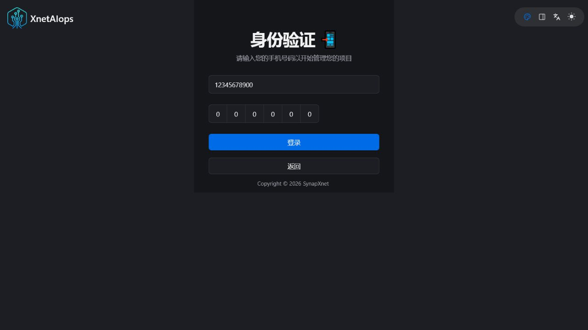
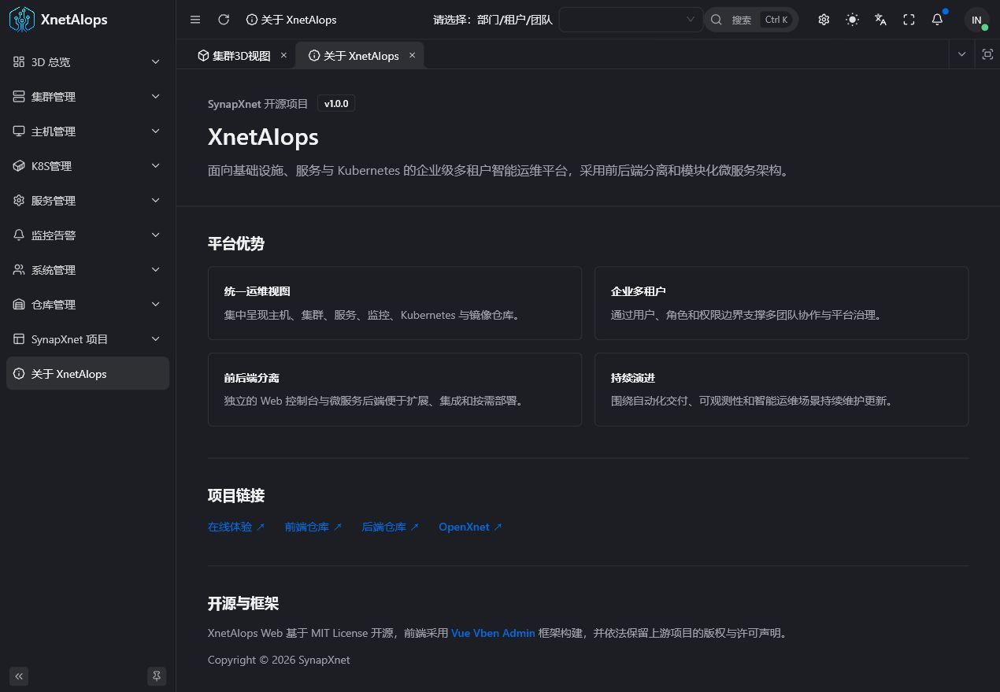
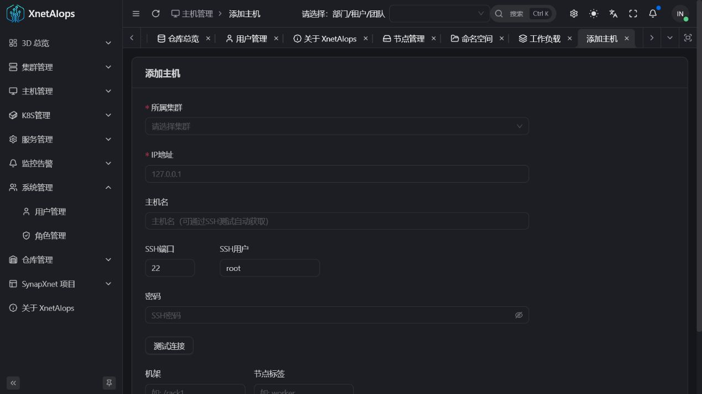
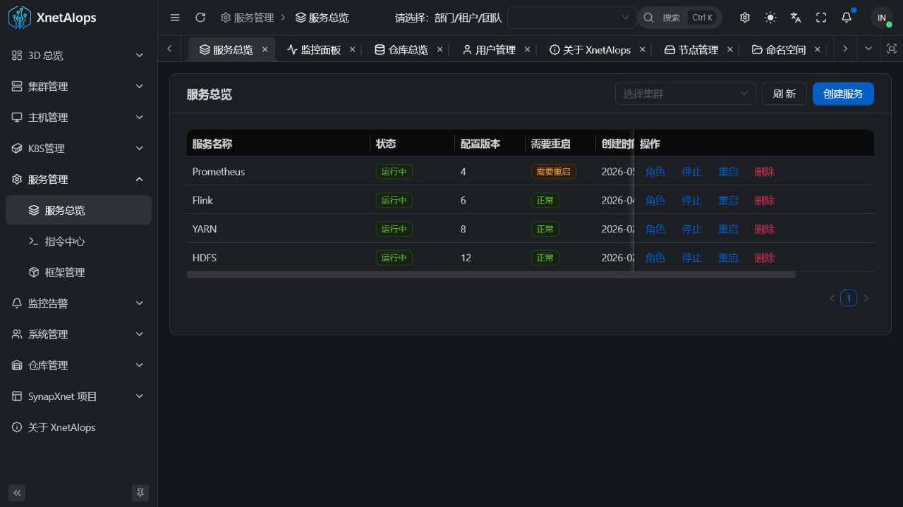
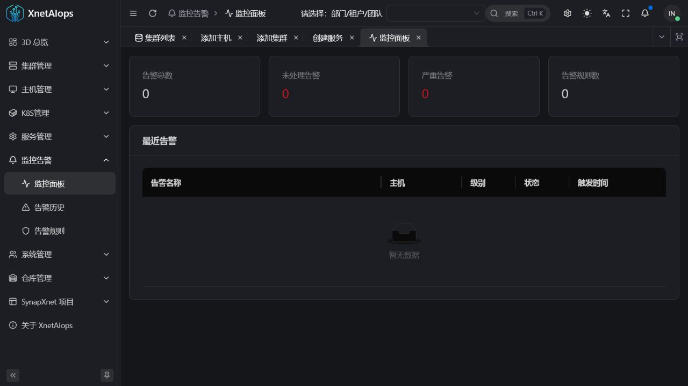
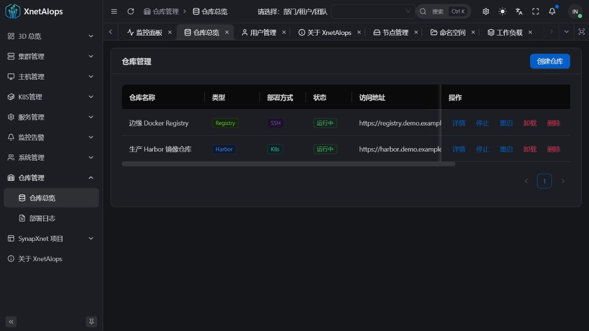
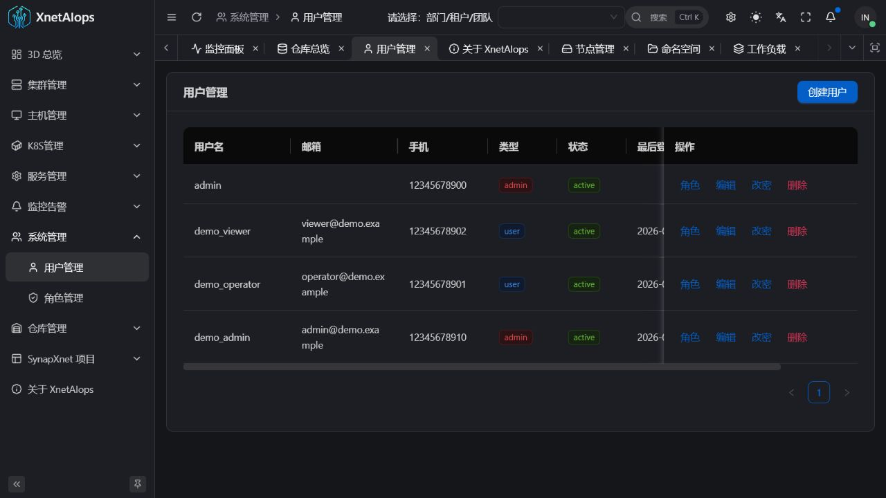

<div align="center">

[简体中文](./README.md) | **English** | [日本語](./README.ja-JP.md)

# XnetAIops Web

**Web console for the XnetAIops intelligent operations platform**

[](https://www.xnetaiops.synapxnet.cn) [](https://vuejs.org/) [](https://www.typescriptlang.org/) [](./LICENSE)

[Live Demo](https://www.xnetaiops.synapxnet.cn) · [Backend: XnetAIops](https://github.com/synapxnet/XnetAIops) · [OpenXnet](https://openxnet.synapxnet.com) · [License](./LICENSE)

</div>



## Product Tour

| Demo login | About |
| --- | --- |
|  |  |
| Cluster management | Host onboarding |
|  |  |
| Kubernetes | Service orchestration |
|  |  |
| Monitoring and alerts | Image registry |
|  |  |
| Multi-tenant users | 3D overview |
|  |  |

## Overview

XnetAIops Web is the open-source operations console maintained by the **SynapXnet team**. It unifies hosts, infrastructure clusters, services, monitoring, Kubernetes, image registries, and access control.

Together with the [XnetAIops backend](https://github.com/synapxnet/XnetAIops), it forms an enterprise-grade, multi-tenant, frontend/backend-separated system. The console is built with Vue 3, TypeScript, Vite, Ant Design Vue, and the [Vue Vben Admin framework](https://github.com/vbenjs/vue-vben-admin).

## Highlights

- Enterprise multi-tenancy with role and resource boundaries.
- One workspace for infrastructure, services, Kubernetes, monitoring, and registries.
- Independent frontend delivery for gateway and deployment flexibility.
- Modular routes and API clients for secondary development.
- Continuous updates from the SynapXnet team.

## Modules

| Module | Capability |
| --- | --- |
| 3D Overview | Cluster, rack, host, and topology visualization |
| CLM | Cluster lifecycle plus MySQL, Redis, Hadoop, and Jenkins |
| HOM | Host inventory, racks, SSH connectivity, and capacity |
| SVM | Service definitions, commands, roles, and lifecycle |
| MON | Metrics, alert rules, alert history, and status overview |
| K8S | Resources, Helm, monitoring, app catalog, and CI/CD |
| REG | Registries, projects, repositories, tags, and replication |
| USR | Users, roles, and platform access control |

## Development

```bash
corepack enable
pnpm install
pnpm dev:antd
pnpm build:antd
```

Use Node.js 20+ and pnpm 9.15.7. Never commit production credentials or access tokens.

## Demo

- URL: <https://www.xnetaiops.synapxnet.cn>
- Phone: `12345678900`
- Verification code: `000000`

The fixed code is only for the public showcase. Production must use secure authentication.

## License and Upstream

Released under the [MIT License](./LICENSE). The frontend uses [Vue Vben Admin](https://github.com/vbenjs/vue-vben-admin); its upstream MIT copyright and license notices are retained.

XnetAIops is part of [OpenXnet](https://openxnet.synapxnet.com). Copyright © 2026 SynapXnet.
