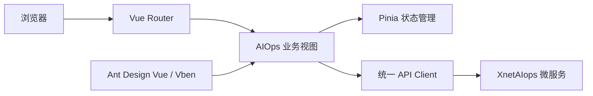

<div align="center">

**简体中文** | [English](./README.en-US.md) | [日本語](./README.ja-JP.md)

# XnetAIops Web

**XnetAIops 智能运维平台的 Web 控制台**

[](https://github.com/synapxnet/XnetAIops-web/releases/tag/v1.3.0) [](https://vuejs.org/) [](https://www.typescriptlang.org/) [](./LICENSE)

[在线体验](https://goai.xnetaiops.synapxnet.online) · [后端仓库 XnetAIops](https://github.com/synapxnet/XnetAIops/tree/v1.3.0) · [OpenXnet 开源社区](https://openxnet.synapxnet.com) · [查看许可](./LICENSE)

</div>

## GOAI 决赛版 · v1.3.0

[发布页与校验文件](https://github.com/synapxnet/XnetAIops-web/releases/tag/v1.3.0) · [下载源码 ZIP](https://github.com/synapxnet/XnetAIops-web/releases/download/v1.3.0/XnetAIops-web-v1.3.0-a5e9c2c0-source.zip) · [查看 v1.3.0 源码](https://github.com/synapxnet/XnetAIops-web/tree/v1.3.0) · [配套后端 XnetAIops](https://github.com/synapxnet/XnetAIops/releases/tag/v1.3.0) · [OpenXnet 桌面安装包](https://github.com/synapxnet/OpenXnet/releases/tag/v1.3.0)

> 当前默认 `display` 分支保留历史代码。徽章表示已公开的 GOAI 版本；复现 v1.3.0 请使用上方固定标签或发布附件，不以此分支代码代替。

包含统一登录与皮肤、驻场 Agent 聊天和配置入口、运行保障工作台及受控终端交互。跨平台协作和审批通过 OpenXnet 与 AgentTeams 组织，页面状态本身不代表已经取得执行授权。

部署依赖、实测结果和能力边界见[本仓源码交付与构建说明](https://github.com/synapxnet/XnetAIops-web/blob/a5e9c2c057ba29d94ee90d7e3acd645e89475f1c/docs/GOAI-FINALS-V1.3.0-SOURCE-DELIVERY.md)。发布源码不代表线上服务已重新部署。本轮生产构建通过，全量类型检查仍有 135 处问题。

> 下方为历史界面截图，仅用于了解原有功能与布局，不作为 v1.3.0 新界面的验收证据。


## 页面预览

| 演示登录 | 关于项目 |
| --- | --- |
|  |  |
| 集群管理 | 主机接入 |
|  |  |
| Kubernetes 集群 | 服务编排 |
|  |  |
| 监控告警 | 镜像仓库 |
|  |  |
| 多租户用户 | Kubernetes 节点 |
|  |  |
| Kubernetes 命名空间 | Kubernetes 工作负载 |
|  |  |

## 项目简介

XnetAIops Web 是由 **SynapXnet 团队**开源的智能运维控制台，也是 XnetAIops 微服务体系的统一交互入口。控制台将主机、集群、服务、监控、Kubernetes 与镜像仓库集中到同一套界面中，便于运维人员在一个工作区完成日常巡检与变更操作。

本仓库是平台前端，与 [XnetAIops](https://github.com/synapxnet/XnetAIops/tree/v1.3.0) 后端仓库共同组成企业级、多租户、前后端分离系统。项目基于 Vue 3、TypeScript、Vite、Ant Design Vue，并采用 [Vue Vben Admin 框架](https://github.com/vbenjs/vue-vben-admin) 构建，适合继续扩展企业级运维场景。

## 项目优势

- **企业多租户**：面向不同组织和团队提供清晰的角色、权限与资源视图。
- **前后端分离**：独立发布 Web 控制台，便于对接不同网关、服务和部署环境。
- **统一工作台**：在同一界面管理主机、集群、服务、监控、Kubernetes 与镜像仓库。
- **持续更新**：SynapXnet 团队会持续完善体验、自动化能力、安全性与项目文档。

## 功能模块

| 模块         | 主要功能                                                |
| ------------ | ------------------------------------------------------- |
| 3D 总览      | 以三维场景展示集群与节点拓扑，提供运维态势入口          |
| CLM 集群管理 | 集群纳管、基础组件部署、部署任务与生命周期操作          |
| HOM 主机管理 | 主机、机架、SSH 连接与资源信息维护                      |
| SVM 服务管理 | 服务概览、命令执行、框架配置及服务生命周期管理          |
| MON 监控告警 | 监控指标、告警历史、告警规则与异常追踪                  |
| K8S 管理     | 集群资源、工作负载、网络、存储、RBAC、Helm 与交付流水线 |
| REG 仓库管理 | 镜像仓库、项目、标签、同步和部署日志                    |
| USR 系统管理 | 用户、角色、权限码与平台访问控制                        |

## 前端架构



## 技术栈

- Vue 3 + TypeScript
- Vite + Turbo
- Ant Design Vue + Vben Admin
- Pinia + Vue Router
- pnpm 9.15.7

## v1.3.0 获取与构建

使用 **Node.js 20.10.0 或更高版本**、固定的 **pnpm 9.15.7**。前端基于 Vue 3、TypeScript 5、Vite、Ant Design Vue 与 Vben 工作区：

```bash
git clone --branch v1.3.0 --depth 1 https://github.com/synapxnet/XnetAIops-web.git
cd XnetAIops-web
corepack enable
corepack prepare pnpm@9.15.7 --activate
pnpm install --frozen-lockfile
pnpm exec turbo build --filter=@vben/web-antd --env-mode=loose
```

产物为 `apps/web-antd/dist`；通过配套 Nginx 或自己的 HTTPS 网关发布。仅启动静态前端不能启动业务后端或驻场 Agent。

### 本地开发与接口

开发命令为 `pnpm dev:antd`，默认端口 `5777`。先修改 `apps/web-antd/vite.config.mts` 中的旧内网代理目标，为自己的后端配置 `/usr`、`/clm`、`/hom`、`/svm`、`/mon`、`/k8s`、`/reg`；K8s 可用 `AIOPS_K8S_DEV_URL` 指定目标。开发代理不会自动发现服务器，也没有完整的驻场代理配置。

生产 `.env.production` 使用同源 `/api/usr`、`/api/clm`、`/api/hom`、`/api/svm`、`/api/mon`、`/api/k8s`、`/api/reg`。驻场 `/api/resident/v1/` 要由网关另行接到独立 Node 服务。后端、驻场、模型凭据和登录授权须分别配置；浏览器中不存放模型 API Key。

本轮生产构建与 45 项前端回归通过；全量类型检查仍有 135 处已知问题，详见源码交付说明。构建成功不代表类型检查通过。

## 在线体验与登录

- 当前 GOAI 演示入口：<https://goai.xnetaiops.synapxnet.online/#/auth/login>。
- 演示手机号：`17870171303`；演示验证码：`000000`（6 位，仅用于本演示环境）。
- 登录方式为“手机号 + 验证码”，不使用 OpenXnet 桌面端的密码登录。当前页面不发送短信，演示验证码由项目方约定。
- 2026-09-18 已核验：登录成功，身份为 `goai_operator` / `OPERATOR`；页面标题为 `XnetAIops`，驻场状态返回 `platform=aiops`、`agentVersion=1.3.0`、`ONLINE`。
- 此验证码只用于平台登录。AgentTeams 演示访问码、Live 执行授权和模型 API Key 是独立凭据，不可互换；后者不在公开 README 提供。

API 网关与网页同源，基址为 `https://goai.xnetaiops.synapxnet.online`。登录为 `POST /api/usr/login`；身份读取为 `GET /api/usr/user/info`；驻场状态为 `GET /api/resident/v1/status`，后两项使用平台登录返回的 Bearer 令牌。业务模块前缀为 `/api/clm`、`/api/hom`、`/api/svm`、`/api/mon`、`/api/k8s`、`/api/reg`。

本轮仅执行登录及身份/驻场状态读取，未执行业务变更或模型调用。`modelConfigured=true` 表示存在服务端配置，不等于本轮已验证模型推理。公共演示账号不应用作生产认证方案。

## SynapXnet 开源生态

本项目属于 SynapXnet 开源项目矩阵。访问 [OpenXnet](https://openxnet.synapxnet.com) 获取更多团队项目与社区信息。

## 参与贡献

欢迎提交 Issue 与 Pull Request。新增页面时请复用现有布局、权限、路由与请求层约定，并确保桌面端常见分辨率下的交互完整性。

## 开源许可

本项目基于 [MIT License](./LICENSE) 开源。前端采用 [Vue Vben Admin 框架](https://github.com/vbenjs/vue-vben-admin)，并依法保留上游项目的 MIT 版权与许可声明。
