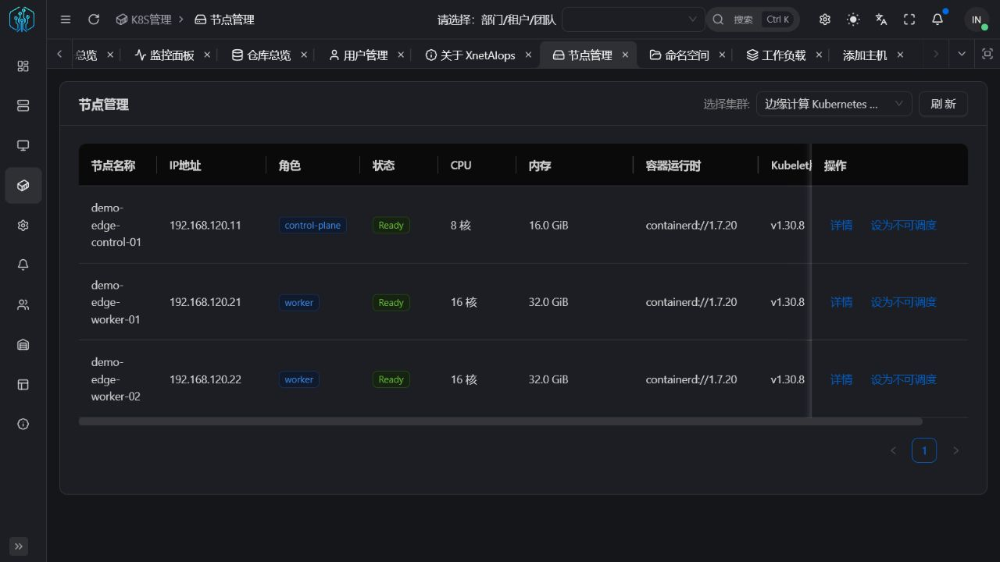
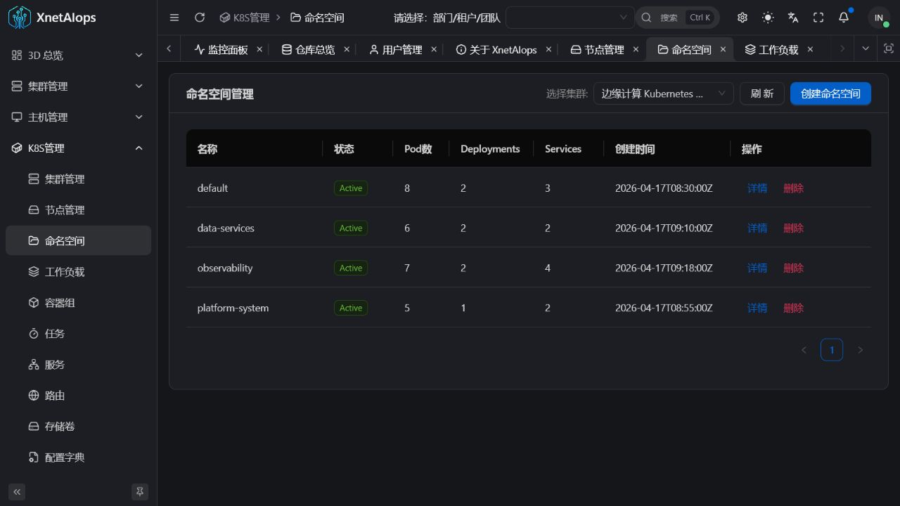
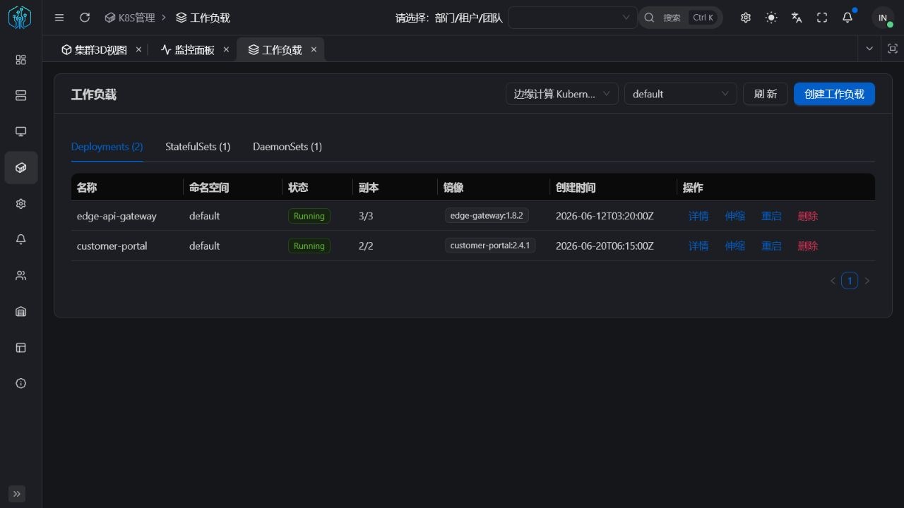
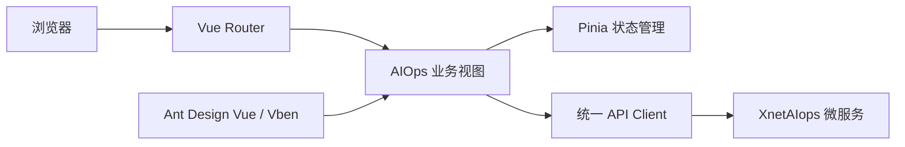

<div align="center">

**简体中文** | [English](./README.en-US.md) | [日本語](./README.ja-JP.md)

# XnetAIops Web

**XnetAIops 智能运维平台的 Web 控制台**

[](https://www.xnetaiops.synapxnet.cn) [](https://vuejs.org/) [](https://www.typescriptlang.org/) [](./LICENSE)

[在线体验](https://www.xnetaiops.synapxnet.cn) · [后端仓库 XnetAIops](https://github.com/synapxnet/XnetAIops) · [OpenXnet 开源社区](https://openxnet.synapxnet.com) · [查看许可](./LICENSE)

</div>


## 页面预览

| 演示登录 | 关于项目 |
| --- | --- |
|  |  |
| 集群管理 | 主机接入 |
|  |  |
| Kubernetes 集群 | 服务编排 |
|  |  |
| 监控告警 | 镜像仓库 |
|  |  |
| 多租户用户 | Kubernetes 节点 |
|  |  |
| Kubernetes 命名空间 | Kubernetes 工作负载 |
|  |  |

## 项目简介

XnetAIops Web 是由 **SynapXnet 团队**开源的智能运维控制台，也是 XnetAIops 微服务体系的统一交互入口。控制台将主机、集群、服务、监控、Kubernetes 与镜像仓库集中到同一套界面中，便于运维人员在一个工作区完成日常巡检与变更操作。

本仓库是平台前端，与 [XnetAIops](https://github.com/synapxnet/XnetAIops) 后端仓库共同组成企业级、多租户、前后端分离系统。项目基于 Vue 3、TypeScript、Vite、Ant Design Vue，并采用 [Vue Vben Admin 框架](https://github.com/vbenjs/vue-vben-admin) 构建，适合继续扩展企业级运维场景。

## GOAI Competition 1.0.0

`GOAI-Competition` 分支新增事件证据深链 `/agent/incidents/:incidentId`，在同一 Trace 中展示告警、工作负载和服务健康事实，支持部分失败、刷新恢复、深浅主题和窄屏布局。页面消费公共 `ToolResponse 1.0.0`，不会把 `success=false` 当作正常数据渲染。

[查看页面参数、联调方式和验证记录](./docs/goai-handoff/HANDOFF-GOAI-COMPETITION-1.0.0.md) · [XnetAIops 后端比赛分支](https://github.com/synapxnet/XnetAIops/tree/GOAI-Competition)

## 项目优势

- **企业多租户**：面向不同组织和团队提供清晰的角色、权限与资源视图。
- **前后端分离**：独立发布 Web 控制台，便于对接不同网关、服务和部署环境。
- **统一工作台**：在同一界面管理主机、集群、服务、监控、Kubernetes 与镜像仓库。
- **持续更新**：SynapXnet 团队会持续完善体验、自动化能力、安全性与项目文档。

## 功能模块

| 模块         | 主要功能                                                |
| ------------ | ------------------------------------------------------- |
| 3D 总览      | 以三维场景展示集群与节点拓扑，提供运维态势入口          |
| CLM 集群管理 | 集群纳管、基础组件部署、部署任务与生命周期操作          |
| HOM 主机管理 | 主机、机架、SSH 连接与资源信息维护                      |
| SVM 服务管理 | 服务概览、命令执行、框架配置及服务生命周期管理          |
| MON 监控告警 | 监控指标、告警历史、告警规则与异常追踪                  |
| K8S 管理     | 集群资源、工作负载、网络、存储、RBAC、Helm 与交付流水线 |
| REG 仓库管理 | 镜像仓库、项目、标签、同步和部署日志                    |
| USR 系统管理 | 用户、角色、权限码与平台访问控制                        |

## 前端架构



## 技术栈

- Vue 3 + TypeScript
- Vite + Turbo
- Ant Design Vue + Vben Admin
- Pinia + Vue Router
- pnpm 9.15.7

## 快速开始

### 环境要求

- Node.js 20+
- pnpm 9.15.7

### 本地开发

```bash
corepack enable
pnpm install
pnpm dev:antd
```

### 生产构建

```bash
pnpm build:antd
```

部署前请根据目标环境检查 `apps/web-antd` 下的环境变量和 API 地址配置。不要将真实密钥、生产令牌或服务器凭据提交到仓库。

## 在线体验

- 访问地址：<https://www.xnetaiops.synapxnet.cn>
- 演示手机号：`17870171303`
- 演示验证码：`000000`

固定验证码仅用于公开演示。生产部署应接入安全的身份认证与验证码服务。

## SynapXnet 开源生态

本项目属于 SynapXnet 开源项目矩阵。访问 [OpenXnet](https://openxnet.synapxnet.com) 获取更多团队项目与社区信息。

## 参与贡献

欢迎提交 Issue 与 Pull Request。新增页面时请复用现有布局、权限、路由与请求层约定，并确保桌面端常见分辨率下的交互完整性。

## 开源许可

本项目基于 [MIT License](./LICENSE) 开源。前端采用 [Vue Vben Admin 框架](https://github.com/vbenjs/vue-vben-admin)，并依法保留上游项目的 MIT 版权与许可声明。
